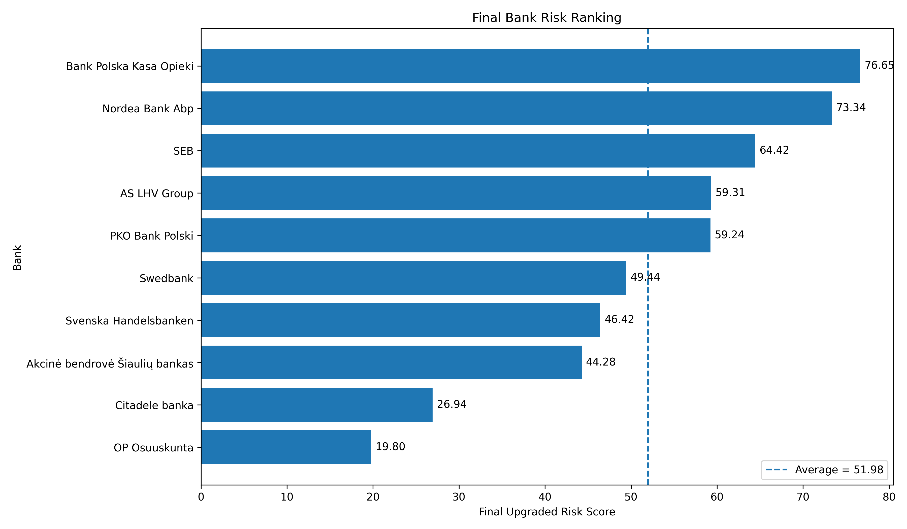
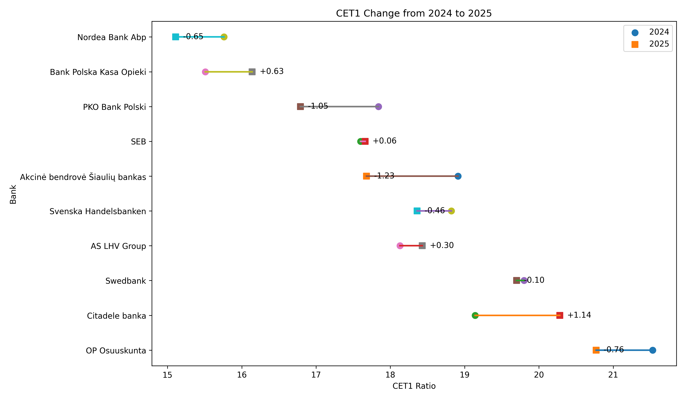
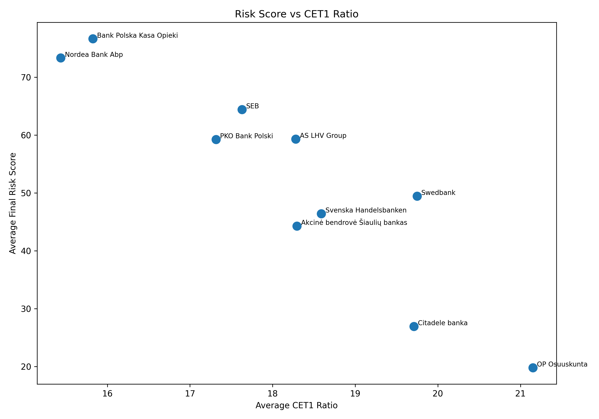
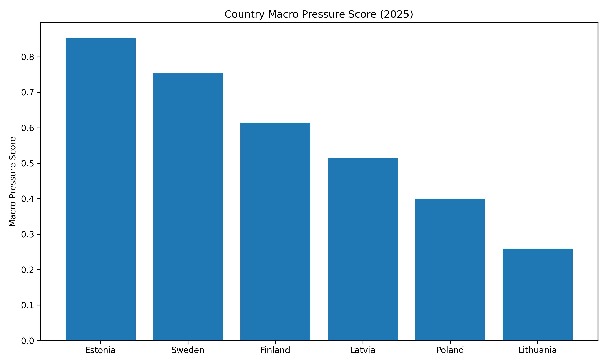
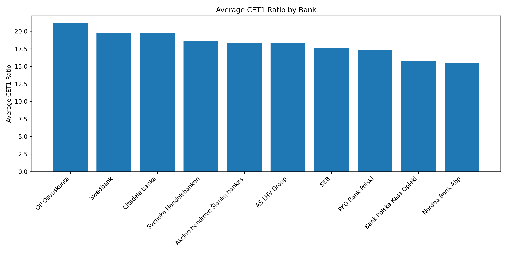

# European Banking Risk Intelligence Platform

> A data-driven multi-factor risk ranking of selected European banks, combining capital adequacy, macroeconomic pressure, asset quality, and profitability signals.

---

## Overview

The **European Banking Risk Intelligence Platform** is a portfolio-oriented banking risk analytics project designed to monitor and compare banking sector resilience across selected European countries. It integrates bank-level supervisory disclosures from the EBA, macroeconomic data from the World Bank API, and selected annual report metrics to construct a composite risk score and ranking for 10 banks across 6 countries.

The project goes beyond simple capital ratio comparison by combining four distinct risk dimensions into a single, weighted composite score — reflecting a more realistic picture of bank-level vulnerability.

---

## Key Findings

- **Most vulnerable:** Bank Polska Kasa Opieki (Poland) and Nordea Bank Abp (Finland) ranked highest under the composite risk framework, driven by elevated macro pressure and weaker profitability signals.
- **Most resilient:** OP Osuuskunta (Finland) and Citadele banka (Latvia) showed the strongest combined profiles across capital, macro, and profitability dimensions.
- **Capital positions:** Latvia and Sweden showed relatively stronger CET1 positions across the sample period.
- **Macro pressure:** Baltic states (Latvia, Lithuania, Estonia) experienced elevated inflation and unemployment pressure during 2022–2024, contributing to higher macro risk scores.
- **Asset quality:** NPL proxy data, where available, reinforced the capital-based ranking in most cases — with Polish banks showing comparatively higher asset quality pressure.

---

## Outputs

### Interactive dashboard

The project includes a fully interactive **Power BI dashboard** for exploring risk scores, CET1 comparisons, and macro pressure across banks and countries.

📊 **File:** [`outputs/European Banking Risk Intelligence Dashboard.pbix`](outputs/European%20Banking%20Risk%20Intelligence%20Dashboard.pbix)

> Open with [Power BI Desktop](https://powerbi.microsoft.com/desktop/) (free).

---

### Static charts

### Final bank risk ranking


### CET1 comparison (2024 vs 2025)


### Risk score vs CET1 ratio


### Macro pressure by country


### Average CET1 by bank


---

## Sample

The project covers **10 banks** across **6 countries**:

| Country | Banks |
|---------|-------|
| Latvia | Citadele banka, ABLV Bank |
| Lithuania | Šiaulių bankas |
| Estonia | LHV Group |
| Poland | Bank Polska Kasa Opieki (Pekao), mBank |
| Finland | OP Osuuskunta, Nordea Bank Abp |
| Sweden | Swedbank, Handelsbanken |

- **Bank-level data:** focused on 2024–2025
- **Macroeconomic data:** spans 2020–2025

---

## Data Sources

### Bank-level
| Source | Data |
|--------|------|
| EBA EU-wide Transparency Exercise | CET1 ratios, risk-weighted assets |
| Annual reports (manual extraction) | NPL proxy, ROA |

### Macro-level
| Source | Indicators |
|--------|------------|
| World Bank API | GDP growth, inflation (CPI), unemployment rate |

---

## Methodology

The project was built in 7 sequential stages:

```
Stage 1  →  Macroeconomic data collection (World Bank API)
Stage 2  →  Bank-year panel construction
Stage 3  →  CET1 data integration and 2024–2025 change analysis
Stage 4  →  Country-level macro pressure score construction
Stage 5  →  NPL proxy identification and integration
Stage 6  →  ROA extraction from annual reports
Stage 7  →  Final composite risk scoring and bank ranking
```

### Composite risk score

The final score is a weighted combination of four risk dimensions:

| Component | Weight | Description |
|-----------|--------|-------------|
| CET1 capital risk | 40% | Based on CET1 ratio level and 2024–2025 change |
| Macro pressure | 30% | Country-level GDP, inflation, unemployment composite |
| NPL proxy risk | 20% | Non-performing loan proxy where available |
| ROA profitability risk | 10% | Return on assets from annual reports where available |

Where NPL or ROA data is unavailable, weights are redistributed proportionally between the remaining components.

> **Why these weights?** Capital adequacy (CET1) is the primary regulatory buffer and the most standardised comparable metric across EBA disclosures — hence the highest weight. Macro pressure captures the external environment that banks cannot control. NPL and ROA provide bank-specific fundamental quality signals but are available for only a subset of the sample, hence lower weights.

---

## Repository Structure

```
European-Banking-Risk-Intelligence-Platform/
│
├── README.md
├── requirements.txt
├── .gitignore
├── LICENSE
│
├── data/
│   └── processed/
│       ├── final_analysis_dataset_with_roa.csv
│       ├── final_upgraded_risk_score.csv
│       ├── bank_risk_ranking_final.csv
│       ├── cet1_change_analysis.csv
│       └── macro_pressure_score_filled.csv
│
├── scripts/
│   ├── 01_macro_data_collection.py
│   ├── 02_bank_panel_build.py
│   ├── 03_cet1_analysis.py
│   ├── 04_macro_pressure_score.py
│   ├── 05_npl_proxy_build.py
│   ├── 06_roa_integration.py
│   └── 07_final_risk_scoring.py
│
├── outputs/
│   ├── European Banking Risk Intelligence Dashboard.pbix
│   ├── final_bank_risk_ranking_advanced.png
│   ├── cet1_dumbbell_chart.png
│   ├── risk_vs_cet1_scatter.png
│   ├── macro_pressure_by_country.png
│   └── cet1_bank_average.png
│
└── docs/
    └── project_summary.md
```

---

## How to Run

```bash
# 1. Clone the repository
git clone https://github.com/elnurqurb4nov/European-Banking-Risk-Intelligence-Platform.git
cd European-Banking-Risk-Intelligence-Platform

# 2. Install dependencies
pip install -r requirements.txt

# 3. Run scripts in order
python scripts/01_macro_data_collection.py
python scripts/02_bank_panel_build.py
python scripts/03_cet1_analysis.py
python scripts/04_macro_pressure_score.py
python scripts/05_npl_proxy_build.py
python scripts/06_roa_integration.py
python scripts/07_final_risk_scoring.py
```

> Each script saves its outputs to `data/processed/`. Final charts are saved to `outputs/`. The Power BI dashboard reads from the processed CSV files.

---

## Dependencies

```
pandas==2.1.4
numpy==1.26.4
matplotlib==3.8.2
seaborn==0.13.2
requests==2.31.0
scikit-learn==1.4.0
openpyxl==3.1.2
```

---

## Limitations

- NPL and ROA data is manually extracted from annual reports and available for a subset of banks only — not all 10 banks have full coverage across all four dimensions.
- CET1 data reflects EBA Transparency Exercise disclosures and may not capture intra-year movements.
- The composite weights are analytically motivated but not empirically calibrated — a formal regression or PCA-based weighting is a natural extension.
- The sample of 10 banks across 6 countries is intentionally focused and is not representative of the full European banking sector.

---

## Potential Extensions

- Expand the sample to all EBA-covered institutions
- Add stress testing scenarios (adverse macro shock simulation)
- Apply PCA or regression-based weight calibration
- Incorporate ECB supervisory data for additional bank-level indicators

---

## License

MIT License — see [LICENSE](LICENSE) for details.
